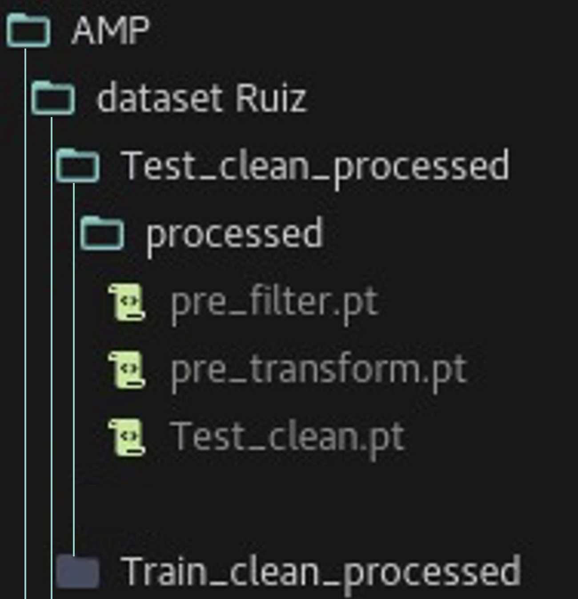
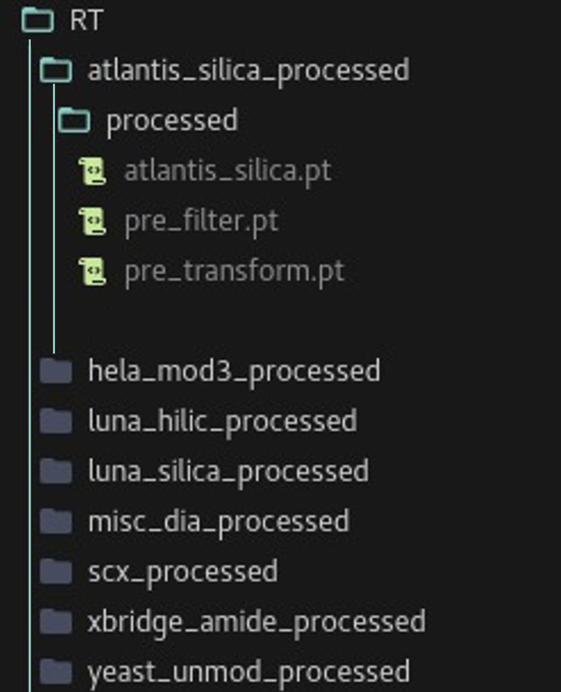

# PepMNet

# 1. Processed Datasets

## AMP

The processed datasets used in this project can be found here:
https://zenodo.org/communities/pepmnet/records?q=&l=list&p=1&s=10&sort=newest.

For each dataset, the 3 .pt files must be saved in the directory:
data/AMP/dataset Ruiz/***"datasetname"***_processed/processed/

**Reference**

The datasets used in this project were sourced from the following reference:

**Ruiz Puentes, P.; Henao, M. C.; Cifuentes, J.; Muñoz-Camargo, C.; Reyes, L. H.; Cruz, J. C.; Arbeláez, P.**  
*Rational Discovery of Antimicrobial Peptides by Means of Artificial Intelligence.* Membranes 2022, 12 (7), 708.  
DOI: [https://doi.org/10.3390/membranes12070708](https://doi.org/10.3390/membranes12070708)

Please ensure to cite this paper if you use these datasets.

## RT

**Processed Datasets**

The processed datasets used in this project can be found here:
https://zenodo.org/communities/pepmnet/records?q=&l=list&p=1&s=10&sort=newest.

For each dataset, the 3 .pt files must be saved in the directory:
data/RT/***"datasetname"***_processed/processed/

**References**

| File Name            | HPLC Type | Reference            |
|----------------------|-----------|----------------------|
| hela_mod.csv          | RPLC      | Sharma et al.        |
| yeast_unmod.csv       | RPLC      | Nagaraj et al.       |
| misc_dia.csv          | RPLC      | Rosenberger et al.   |
| SCX.csv               | SCX       | Gussakovsky et al.   |
| Luna_hilic.csv        | HILIC     | Spicer et al.        |
| xbridge_amide.csv     | HILIC     | Spicer et al.        |
| atlantis_silica.csv   | HILIC     | Spicer et al.        |
| luna_silica.csv       | HILIC     | Spicer et al.        |

- **Nagaraj, N.; Kulak, N. A.; Cox, J.; Neuhauser, N.; Mayr, K.; Hoerning, O.; Vorm, O.; Mann, M.**  
  *System-Wide Perturbation Analysis with Nearly Complete Coverage of the Yeast Proteome by Single-Shot Ultra HPLC Runs on a Bench Top Orbitrap.* Mol. Cell. Proteomics 2012, 11 (3), M111.013722 DOI: [10.1074/mcp.M111.013722](https://doi.org/10.1074/mcp.M111.013722)

- **Sharma, K.; D’Souza, R. C. J.; Tyanova, S.; Schaab, C.; Wiśniewski, J. R.; Cox, J.; Mann, M.**  
  *Ultradeep Human Phosphoproteome Reveals a Distinct Regulatory Nature of Tyr and Ser/Thr-Based Signaling.* Cell Rep. 2014, 8 (5), 1583–1594, DOI: [10.1016/j.celrep.2014.07.036](https://doi.org/10.1016/j.celrep.2014.07.036)

- **Rosenberger, G.; Koh, C. C.; Guo, T.; Röst, H. L.; Kouvonen, P.; Collins, B. C.; Heusel, M.; Liu, Y.; Caron, E.; Vichalkovski, A., et al.**  
  *A Repository of Assays to Quantify 10,000 Human Proteins by SWATH-MS.* Sci. Data 2014, 1, 140031, DOI: [10.1038/sdata.2014.31](https://doi.org/10.1038/sdata.2014.31)

- **Gussakovsky, D.; Neustaeter, H.; Spicer, V.; Krokhin, O. V.**  
  *Sequence-Specific Model for Peptide Retention Time Prediction in Strong Cation Exchange Chromatography.* Anal. Chem. 2017, 89 (21), 11795–11802, DOI: [10.1021/acs.analchem.7b03436](https://doi.org/10.1021/acs.analchem.7b03436)

- **Spicer, V.; Krokhin, O. V.**  
  *Peptide Retention Time Prediction in Hydrophilic Interaction Liquid Chromatography. Comparison of Separation Selectivity between Bare Silica and Bonded Stationary Phases.* J. Chromatogr. A 2018, 1534, 75–84, DOI: [10.1016/j.chroma.2017.12.046](https://doi.org/10.1016/j.chroma.2017.12.046)

**Acknowledgements**

All datasets were implemented and curated from:

- **Ma, C.; Ren, Y.; Yang, J.; Ren, Z.; Yang, H.; Liu, S.**  
  *Improved Peptide Retention Time Prediction in Liquid Chromatography through Deep Learning.* Anal. Chem. 2018, 90 (18), 10881–10888. DOI: [10.1021/acs.analchem.8b02386](https://doi.org/10.1021/acs.analchem.8b02386)

Please ensure to cite the respective papers if you use these datasets.

# 2. Pretrained models

Pretrained models used in this project can be found here: https://zenodo.org/communities/pepmnet/records?q=&l=list&p=1&s=10&sort=newest.

The **.pt** files must be saved in the directies: 

**Retention Time Prediction:**
weights_RT/

**Antimicrobial Classification:**
weights_AMP/

